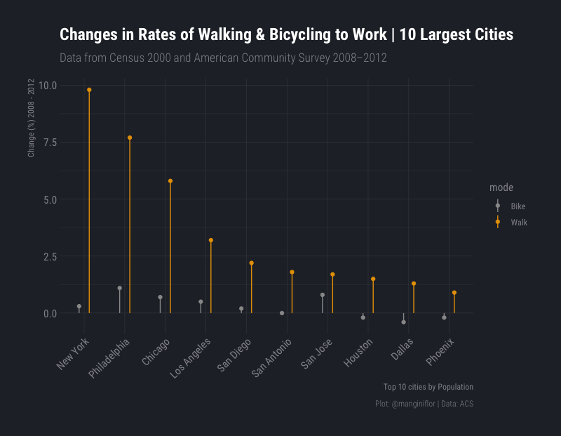
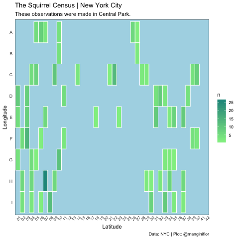

# TidyTuesday

**#tidytuesday**, is a weekly project to be analyzed by the R community. Following there are my contributions.
## November 5th, 2019 | ACS 

[Code](https://github.com/frm1789/tidytuesday/blob/master/2019_45_acs_survey/Plot.R)

## October 29th, 2019 | Squirrel Census

[Code](https://github.com/frm1789/tidytuesday/blob/master/2019_44_nyc_squirrels/code.R) 

## October 22th, 2019 | Horror movies

[Code](https://github.com/frm1789/tidytuesday/blob/master/2019_43_Horror_Movies/code.R) 

## October 15th, 2019 | Car Fuel Economy

[Code](https://github.com/frm1789/tidytuesday/blob/master/2019_42_big_EPA_cars/bigCar.R) 

## May 21th, 2019 | Global Plastic Waste

[Code](https://github.com/frm1789/tidytuesday/tree/master/2019_21_plastic_waste) 

## May 14th, 2019 | Nobel prize winners

[Code](https://github.com/frm1789/tidytuesday/blob/master/2019_20_Nobel_prize.R) 
